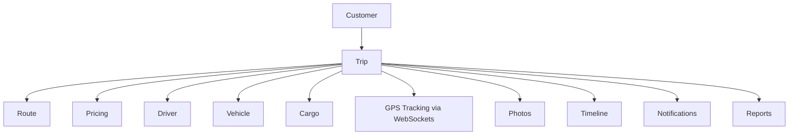

# MERCON Logistics — Product Blueprint

Version: 1.1 (Unified)  
Date: July 2026  
Prepared For: MERCON Logistics Services Company  

## Information Architecture

### Driver Operations App
- Splash Screen
- Login (Mobile Number + PIN)
- Waiting for Assignment
- **Active Trip**
  - Trip Summary
  - Start Trip
  - Cargo Photo Upload
  - Navigation
  - Emergency
  - Arrival Detection
  - Delivery Photo Upload
  - Complete Trip
- Trip History
- Notifications
- Profile
- Settings

### Operator Mobile App
- Login (Email + Password)
- **Dashboard**
  - Live Trips
  - Today's Trips
  - Scheduled Trips
  - Driver Availability
  - Emergency Alerts
  - Maintenance Alerts
  - Document Expiry
- **Trip Management**
  - Trip List
  - Trip Details → Live Tracking → Live Map
  - Create Trip (Route → Cargo → Schedule → Pricing → Vehicle → Driver → Review)
- **Alerts**
- Profile
- Settings

### Operator Web Dashboard
- **Dashboard**: KPIs · Today's Trips · Live Activity · Fleet Status · Driver Availability · Notifications
- **Trip Management**: Create · Active · Scheduled · Completed · Cancelled · Trip Details · Share Trip
- **Live Monitoring (WebSockets)**: Live Map · Driver GPS · ICCES GPS · Trip Timeline · Emergency Alerts
- **Customer Management**: Customers · Profile · Quotations · Contracts · Trip History
- **Driver Management**: Drivers · Profile · Availability · Documents · Performance
- **Fleet Management**: Trucks · Trailers · Maintenance · Documents · Availability
- **Pricing**: Route Pricing · Customer Pricing · Quotations · Pricing History
- **Reports**: Daily · Weekly · Monthly · Driver · Fleet · Customer · Revenue
- Notifications
- Profile
- Settings

### Admin Web Dashboard
- Dashboard
- User Management (Users · Roles · Permissions)
- Customer Management
- Driver Management
- Fleet Management
- Pricing Management
- Reports & Analytics
- Audit Logs
- Integrations (Google Maps · ICCES · Notifications · Storage)
- System Settings

### Shared Platform Services
- Authentication (JWT)
- Authorization (Role-based)
- Trip Engine
- Pricing Engine
- Notification Engine
- **GPS Tracking Engine (Socket.io WebSockets)**
- ICCES Integration
- Media Storage (Cloudflare R2)
- Document Management
- Reporting Engine
- Audit & Activity Logs
- Backup & Recovery
- API Services (Express Node.js)

---

## Architectural Recommendation — Trip-Centric Architecture

A recommended refinement: make the Operator Web Dashboard the central hub of the entire system. Rather than treating Trips, Fleet, Drivers, and Customers as separate sections, organize everything around the **Trip** — the platform's core business object, to which every other entity relates.

This Trip-Centric Architecture keeps the UI, backend, database, APIs, and reports aligned around the company's primary business process — making the system easier to understand, maintain, and extend as MERCON grows.
