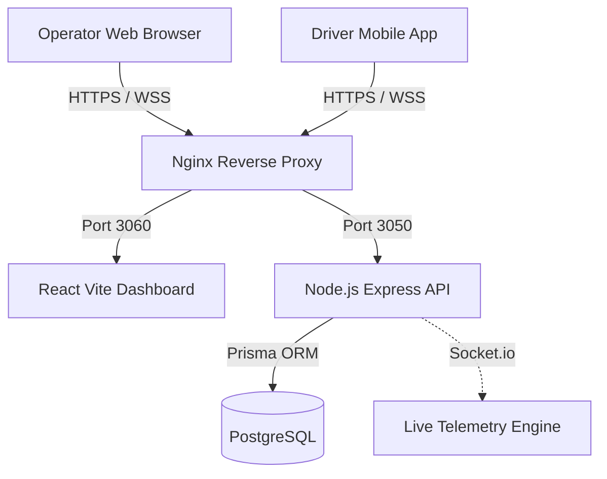

# MERCON System Architecture

The MERCON platform is structured into a modern, decoupled microservices-lite architecture designed for high availability and real-time operations.

## High-Level Topology

## 1. Frontend Web Dashboard (`frontend/web-dashboard`)
- **Framework**: React 18 with Vite.
- **State Management**: TanStack React Query for server state caching.
- **Routing**: React Router with protected route wrappers (`AuthContext`).
- **Styling**: TailwindCSS configured with a strict design system palette.
- **Port**: Runs internally on port 3060 (via Docker Compose).

## 2. API Server (`backend/api-server`)
- **Framework**: Node.js + Express.
- **Database ORM**: Prisma ORM with strict referential integrity.
- **Authentication**: JWT stateless authentication.
- **Port**: Runs internally on port 3050 (via Docker Compose).

## 3. Real-Time Telemetry Engine
- **Engine**: Socket.io running alongside the Express HTTP Server.
- **Purpose**: Facilitates low-latency GPS coordinate streaming from mobile devices to the operator dashboards.
- **CORS**: Configured to accept cross-origin requests from both the web dashboard and future mobile apps.

## 4. Deployment Pipeline
The CI/CD pipeline pushes code directly to the VPS.
- **Nginx**: Acts as the SSL terminator (Let's Encrypt Certbot) and load balancer.
  - Traffic to `mercon.tech/api/*` is stripped of `/api` and forwarded to port 3050.
  - Traffic to `mercon.tech/*` is forwarded to port 3060.
- **Docker Compose**: Orchestrates the frontend, backend, and PostgreSQL database into a single cohesive network.
