# MERCON User Flows

Complete flow documentation with Mermaid diagrams for all major user journeys.

---

## Authentication Flow (Driver)

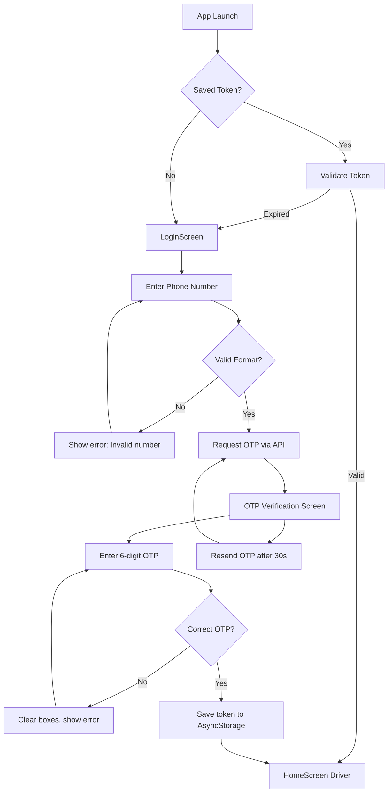

---

## Authentication Flow (Operator)

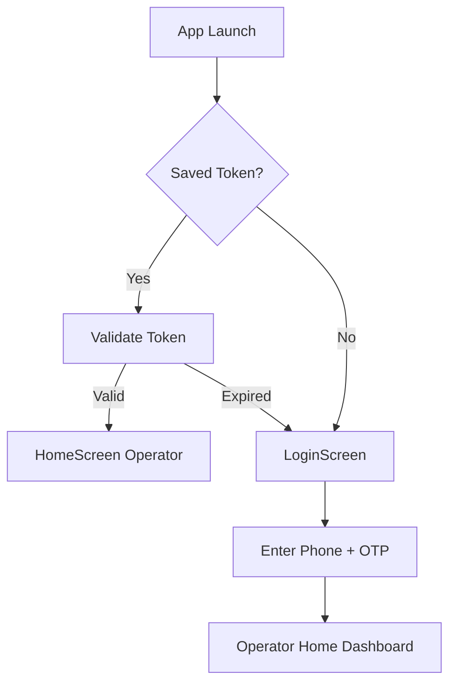

---

## Driver Trip Execution Flow

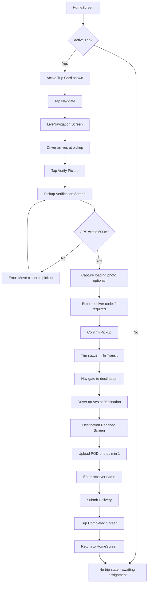

---

## Create Trip Flow (Operator)

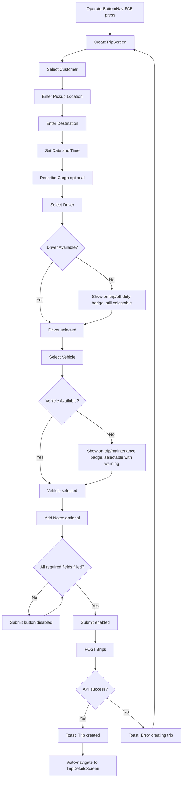

---

## Navigation Flow — Driver App

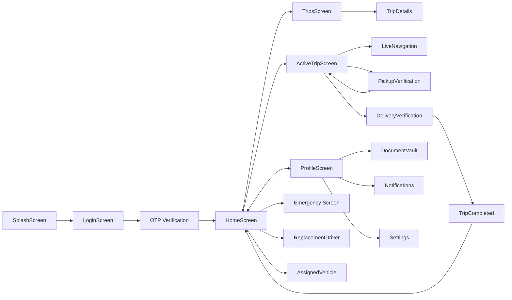

---

## Navigation Flow — Operator App

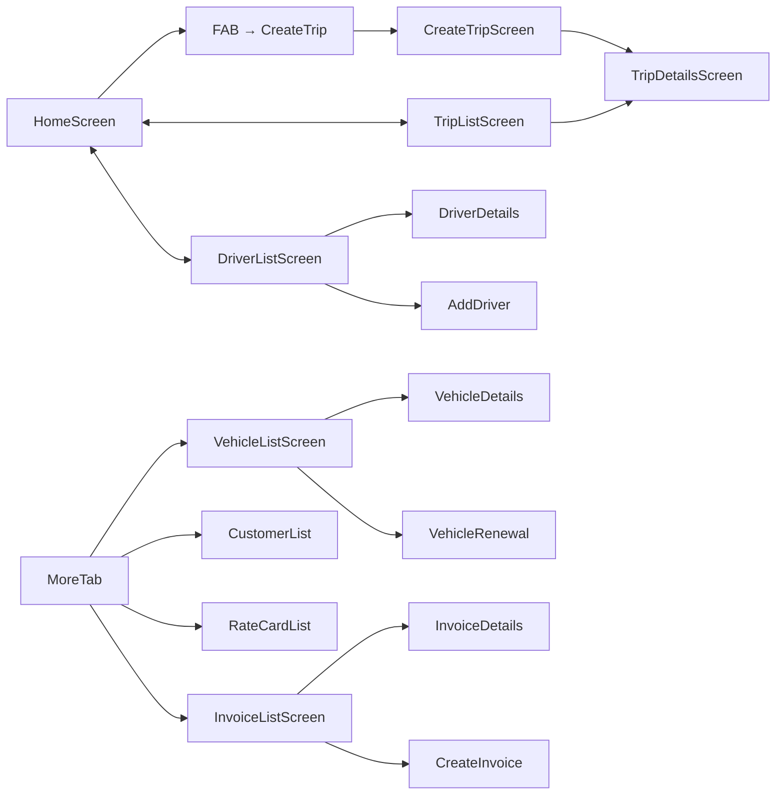

---

## Document Upload Flow (Driver)

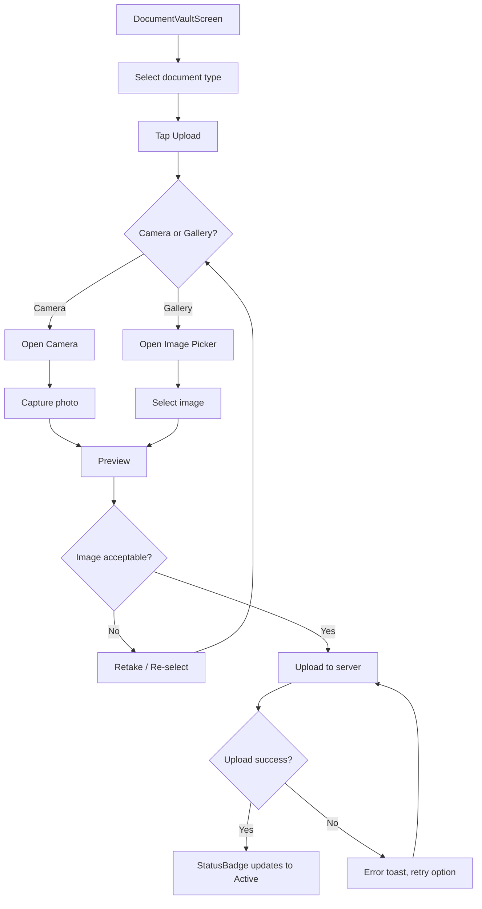

---

## Notification Flow

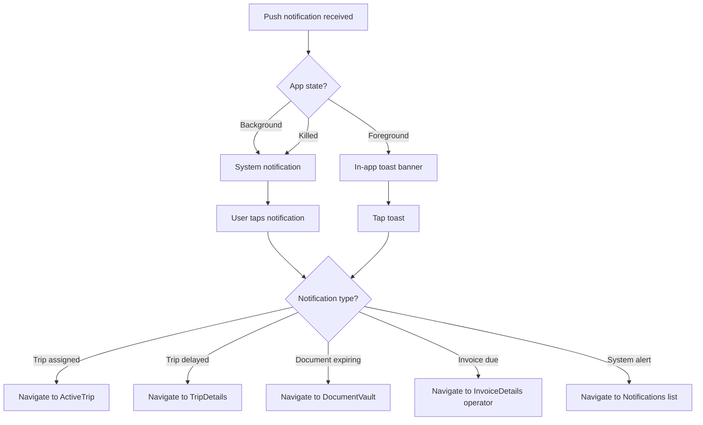

---

## Error Handling Flow

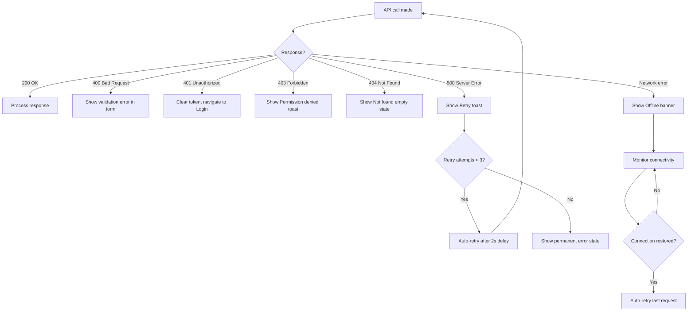

---

## Offline Mode Flow

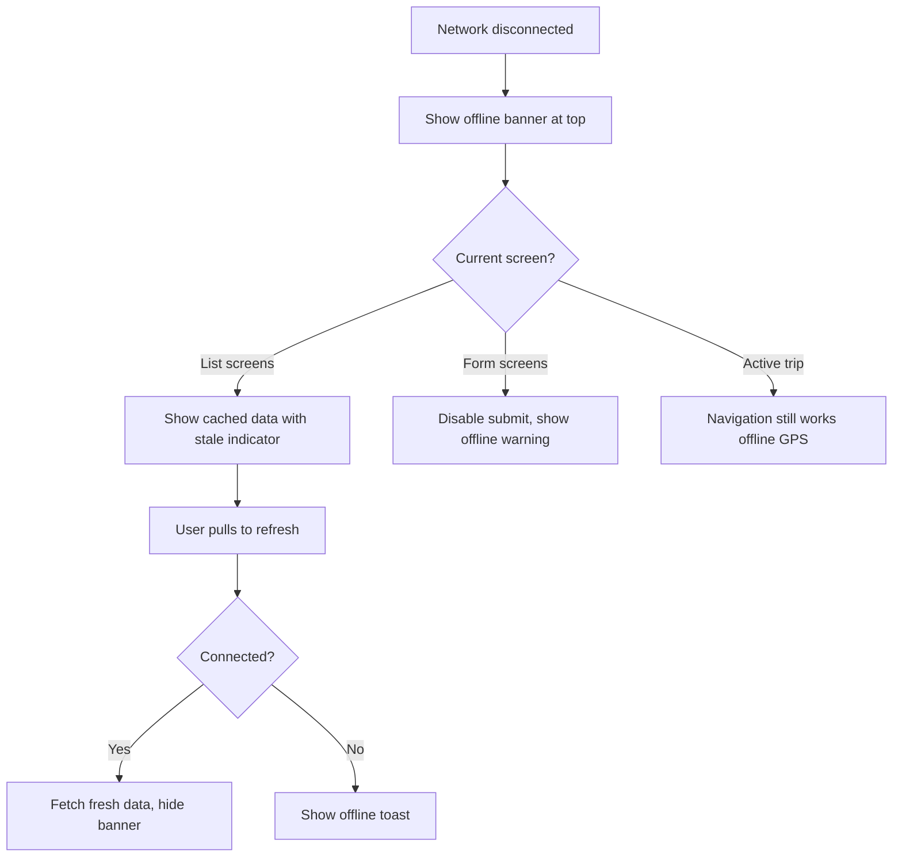

---

## Settings and Profile Flow

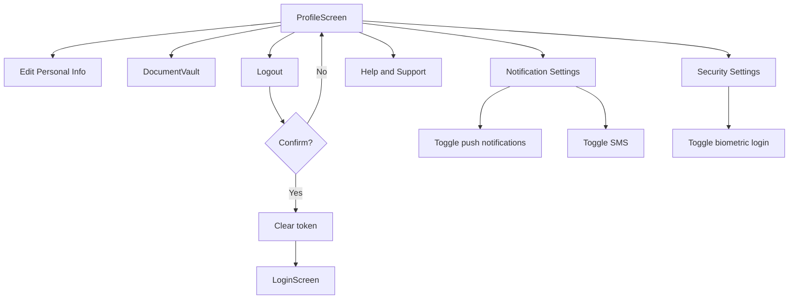

---

## Vehicle Renewal Flow (Operator)

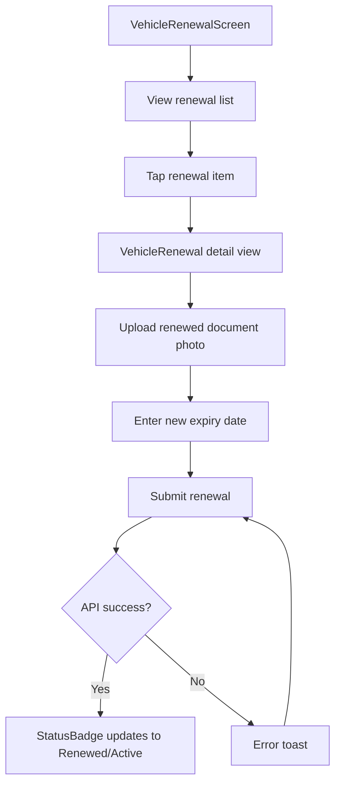

---

## Invoice Creation Flow (Operator)

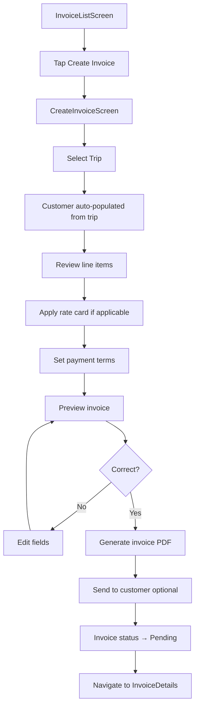
